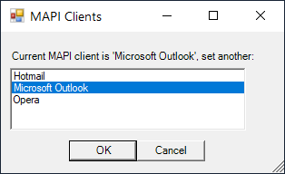

# Windows GUI to change current MAPI provider


Just a simple powershell script to change MAPI provider.

## Example usage
```powershell
.\Set-DefaultMapiClient.ps1
```

Or just download ps1 file, right click on it and select 'Run with PowerShell'

## Is SimpleMAPI configured properly on my system?

Open Windows Explorer, find some file you will send via default email client, right click on file, Show More Options (if Win11), Send to, Mail recipient. It will open default MAPI client if everything is fine.

Or try running included powershell script [Send-EmailViaSimpleMapi.ps1](examples/Send-EmailViaSimpleMapi.ps1)

## Troubleshooting
If above test fails try some of this resources, it might help:
 - Try to run "fixmapi" from cmd prompt.
 - Try to run script with admin rights.
 - Log off / Log on
 - Mozilla Thunderbird has buggy MAPI support https://kb.mozillazine.org/MAPI_Support
 - Microsoft Outlook (old one) usually works best
 - eM Client has some good thread to check https://forum.emclient.com/t/mapi-on-windows-11/92822

## License
public domain  or any other license for reused work from original authors
